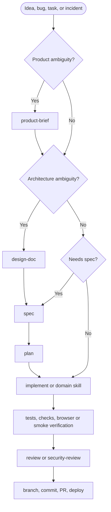

# AgentStack

> Open AI agent skills for building, shipping, operating, securing, and growing software products.

AgentStack is a practical workflow library for software engineering agents. It combines disciplined delivery skills with domain workflows for product development, fullstack engineering, backend systems, frontend UI, DevOps, server administration, cybersecurity, incident response, and interview preparation.

The goal is simple: give agents clear, reusable operating procedures that produce better engineering outcomes without burying them in ceremony.

## Principles

- **Workflow over trivia.** Skills encode how to work, not every fact an engineer might know.
- **Verification is non-negotiable.** Tests, checks, browser verification, smoke tests, and operational validation matter.
- **Smallest useful unit.** Each skill should have a clear trigger, boundary, and stopping point.
- **Real engineering judgment.** Agents should inspect the existing system, preserve contracts, and call out risk.
- **Contributor-friendly.** New skills should be short, reviewable, and useful outside one private project.

## Skill Stack

| Area | Skills | Purpose |
|---|---|---|
| Product | `product-brief` | Shape ideas into users, scope, requirements, risks, and success metrics |
| Architecture | `design-doc` | Explore ambiguous architecture decisions, alternatives, and tradeoffs |
| Definition | `spec`, `plan` | Write implementation specs and split them into reviewable tasks |
| Build | `implement`, `tdd`, `fullstack-feature`, `backend-api`, `frontend-ui` | Execute focused engineering work with tests and verification |
| Operations | `devops-deploy`, `server-admin`, `incident-response`, `browser-verify` | Deploy, operate, debug, and verify real systems |
| Security | `security-review` | Review code, config, and workflows for practical security risk |
| Quality | `refactor`, `review`, `address-pr-feedback` | Improve code shape, review changes, and handle PR feedback |
| Writing | `technical-article` | Write researched technical articles with verified examples and optional author voice |
| Learning | `dsa-teacher` | Teach DSA and competitive programming problems step by step with practice sets |
| Career | `interview-prep`, `coding-interview`, `system-design-interview`, `behavioral-interview` | Prepare for role strategy, coding, system design, behavioral, leadership, and project interviews |
| Git | `branch`, `commit` | Keep branches and commits traceable |

## Recommended Flow



Use the full flow for ambiguous, cross-cutting, user-visible, security-sensitive, or contract-changing work. For trivial changes, do the work directly and verify it.

Domain skills such as `fullstack-feature`, `backend-api`, `frontend-ui`, and `devops-deploy` are implementation-phase skills. Use `spec` and `plan` first when the work changes contracts, schemas, user-visible behavior, multiple files, or operational invariants.

## Install

Install AgentStack from GitHub with the `skills` CLI:

```bash
npx skills add Faiyajz/agentstack
```

For local Codex testing without the `skills` CLI, clone the repo and copy the skills into Codex's skills directory:

```bash
git clone https://github.com/Faiyajz/agentstack.git
cd agentstack
mkdir -p ~/.codex/skills
cp -r skills/* ~/.codex/skills/
```

Restart your agent after installing so it reloads the skill metadata.

## Update

If installed with the `skills` CLI:

```bash
npx skills update
```

If installed by copying into Codex manually:

```bash
cd agentstack
git pull
cp -r skills/* ~/.codex/skills/
```

Restart your agent after updating.

## Invoking Skills

Install or expose the skills through your agent host. When command namespaces are available, use:

```text
/agentstack:product-brief
/agentstack:design-doc
/agentstack:spec
/agentstack:plan
/agentstack:implement
/agentstack:tdd
/agentstack:fullstack-feature
/agentstack:backend-api
/agentstack:frontend-ui
/agentstack:devops-deploy
/agentstack:server-admin
/agentstack:security-review
/agentstack:incident-response
/agentstack:interview-prep
/agentstack:coding-interview
/agentstack:system-design-interview
/agentstack:behavioral-interview
/agentstack:technical-article
/agentstack:dsa-teacher
/agentstack:review
/agentstack:commit
```

The standalone skill names are the stable vocabulary. Host-specific slash commands are aliases.

## Skills

| Skill | What it does | Example |
|---|---|---|
| `product-brief` | Writes a product brief before technical design | `Create a product brief for a team expense app` |
| `design-doc` | Writes `docs/<design-slug>/design.md` for architecture tradeoffs | `Write a design doc for multi-tenant auth` |
| `spec` | Writes `docs/<feature-slug>/spec.md` for implementation | `Write a spec for user-auth` |
| `plan` | Breaks a brief or spec into agent-sized tasks | `Create a plan for user-auth` |
| `implement` | Executes one scoped change with tests and verification | `Implement task 2 from user-auth` |
| `tdd` | Implements behavior test-first | `Use TDD for retry logic` |
| `fullstack-feature` | Ships one vertical UI/API/data slice | `Build saved searches end to end` |
| `backend-api` | Builds API, service, schema, and backend changes | `Add cursor pagination to the users API` |
| `frontend-ui` | Builds accessible, responsive browser UI | `Build the billing settings page` |
| `devops-deploy` | Handles deployment, CI/CD, rollback, and smoke checks | `Prepare Docker deploy for the API` |
| `server-admin` | Safely diagnoses and administers Linux servers | `Debug nginx 502s on the production host` |
| `security-review` | Reviews practical security risk and fixes when requested | `Security-review the auth diff` |
| `incident-response` | Triage, mitigate, communicate, and follow up on incidents | `Triage high API latency` |
| `interview-prep` | Routes and coordinates multi-round interview preparation | `Prep me for a senior backend interview` |
| `coding-interview` | Runs coding, algorithms, debugging, and live coding practice | `Run a 45-minute arrays mock interview` |
| `system-design-interview` | Runs architecture and scaling interview practice | `Mock a senior system design interview` |
| `behavioral-interview` | Shapes and practices leadership, impact, and project stories | `Practice ownership stories for staff engineer interviews` |
| `technical-article` | Writes researched technical articles with runnable examples | `Write a tutorial about cursor pagination in FastAPI` |
| `dsa-teacher` | Explains DSA and competitive programming problems step by step | `Teach Codeforces 1200 two pointers with 20 similar questions` |
| `refactor` | Simplifies changed code without behavior changes | `Refactor the current diff` |
| `review` | Reviews code for correctness, security, simplicity, and tests | `Review the current diff` |
| `address-pr-feedback` | Triage and address GitHub PR feedback | `Address PR feedback on #42` |
| `browser-verify` | Verifies browser-rendered work in a real browser | `Browser-verify the dashboard` |
| `branch` | Creates a traceable Git branch | `Create a branch for AUTH-123` |
| `commit` | Stages intended changes and writes a Conventional Commit | `Commit the current changes` |

## Adding Skills

Each skill lives at `skills/<skill-name>/SKILL.md` with YAML frontmatter:

```yaml
---
name: skill-name
description: "What the skill does and when to use it."
user-invocable: true
argument-hint: "<expected input>"
---
```

Keep the body concise:

- role or stance
- ordered workflow
- rules and stopping conditions
- concrete verification when applicable

See [docs/skill-roadmap.md](docs/skill-roadmap.md) for recommended future skills.

## Browser Verification

`browser-verify` requires Chrome DevTools MCP:

```bash
claude mcp add chrome-devtools --scope user npx chrome-devtools-mcp@latest
codex mcp add chrome-devtools -- npx chrome-devtools-mcp@latest
```

## License

AgentStack is released under the [MIT License](LICENSE).
